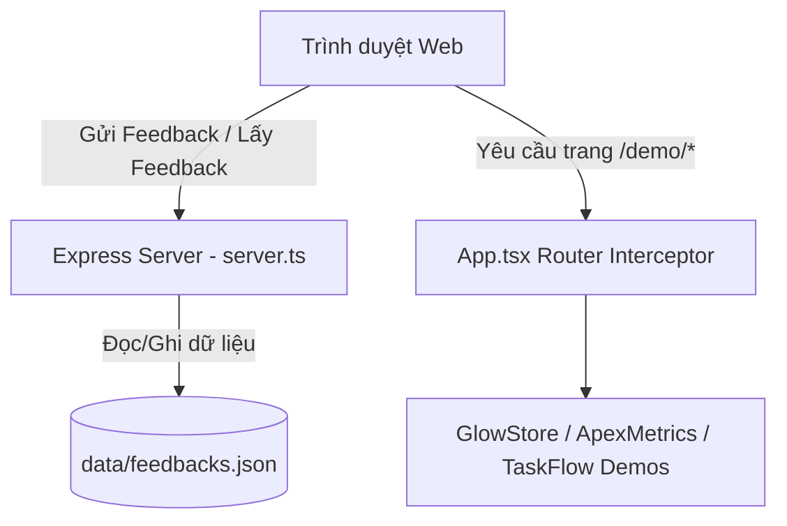

# Cấu trúc Dự án Portfolio (Hưng Lê)

Tài liệu này mô tả chi tiết cấu trúc thư mục, kiến trúc kỹ thuật và các thành phần cốt lõi của dự án **Developer Portfolio (Hưng Lê)**. Dự án là sự kết hợp giữa giao diện Portfolio hiện đại và các ứng dụng Demo tương tác thực tế đi kèm hệ thống quản lý phản hồi (Admin Dashboard).

---

## 1. Sơ đồ Cấu trúc Thư mục (Directory Tree)

Dưới đây là sơ đồ tổ chức thư mục của dự án:

```text
Portfolio/
├── .env.example             # File cấu hình môi trường mẫu (GEMINI_API_KEY,...)
├── .gitignore               # Cấu hình bỏ qua các file không cần commit lên Git
├── README.md                # Tài liệu hướng dẫn cài đặt và chạy dự án nhanh
├── package.json             # Định nghĩa dependencies, devDependencies và scripts
├── tsconfig.json            # Cấu hình TypeScript compiler
├── vite.config.ts           # Cấu hình Vite (tích hợp React và Tailwind CSS v4)
├── server.ts                # Custom Express server (Full-stack API & Serving frontend)
├── data/                    # Thư mục cơ sở dữ liệu dạng file phẳng
│   └── feedbacks.json       # Lưu trữ danh sách phản hồi từ khách hàng (được tự động tạo)
├── assets/                  # Tài liệu hoặc assets tĩnh dùng cho ứng dụng
│   └── .aistudio/           # Metadata liên quan tới AI Studio
└── src/                     # Mã nguồn chính của ứng dụng Frontend
    ├── main.tsx             # Điểm khởi đầu (Entrypoint) của ứng dụng React
    ├── App.tsx              # Component gốc quản lý layout và Routing Interceptor
    ├── index.css            # Stylesheet chính (Cấu hình Tailwind CSS v4)
    ├── types.ts             # Khai báo các TypeScript interfaces (Project, Feedback)
    ├── data/                # Chứa dữ liệu tĩnh phục vụ hiển thị
    │   └── projectsData.ts  # Danh sách thông tin chi tiết của 3 dự án nổi bật
    ├── components/          # Các Component giao diện của trang Portfolio chính
    │   ├── Navbar.tsx       # Thanh điều hướng đầu trang (hỗ trợ cuộn mượt và Admin link)
    │   ├── Hero.tsx         # Phần giới thiệu tổng quan ấn tượng
    │   ├── Skills.tsx       # Trực quan hóa các kỹ năng lập trình bằng tiến trình/icon
    │   ├── ProjectsShowcase.tsx # Danh sách dự án nổi bật và liên kết tới trang Demo
    │   ├── FeedbackSection.tsx  # Giao diện hiển thị và form gửi phản hồi khách hàng
    │   ├── AdminDashboard.tsx   # Bảng điều khiển quản lý và cập nhật trạng thái phản hồi
    │   └── DemoSpecHeader.tsx   # Header thông số kỹ thuật (Lighthouse, Load time) cho trang Demo
    └── demos/               # Các ứng dụng Demo tương tác thực tế
        ├── ApexMetricsDemo.tsx  # Demo 1: Bảng quản trị phân tích dữ liệu SaaS (SVG Charts)
        ├── GlowStoreDemo.tsx    # Demo 2: Cửa hàng mỹ phẩm cao cấp (Framer Motion, Giỏ hàng)
        └── TaskFlowDemo.tsx     # Demo 3: Bảng quản lý công việc Kanban (Drag & Drop)
```

---

## 2. Tổng quan Kiến trúc Kỹ thuật (Architecture Overview)

Dự án được thiết kế theo mô hình **Full-stack Single Page Application (SPA)** tự khởi chạy, kết hợp giữa Express (Node.js) ở Backend và React 19 ở Frontend.



### A. Frontend (Giao diện)
- **Framework**: React 19 (sử dụng Functional Components và Hooks).
- **Styling**: Tailwind CSS v4 (tối ưu hóa hiệu năng biên dịch nhờ tích hợp sâu với Vite).
- **Hiệu ứng động**: Thư viện `motion` (Framer Motion) đem lại trải nghiệm mượt mà, chuyên nghiệp.
- **Icons**: `lucide-react` cung cấp bộ icon phong phú, tối giản.
- **Routing**: Tự xây dựng cơ chế định tuyến (interceptor) nhẹ nhàng trong `App.tsx` bằng cách lắng nghe sự kiện thay đổi của `window.location.pathname` để render trực tiếp trang demo mà không cần thêm thư viện routing cồng kềnh.

### B. Backend (Máy chủ API)
- **Runtime**: Node.js viết bằng TypeScript thông qua `server.ts`.
- **Framework**: Express.js xử lý yêu cầu HTTP và phục vụ API.
- **Đóng gói & Chạy**: 
  - Trong môi trường phát triển (Dev): Tích hợp trực tiếp Vite middleware (`vite.middlewares`) giúp Hot Module Replacement (HMR) hoạt động đồng thời trên cùng một cổng 3000.
  - Trong môi trường sản phẩm (Production): Serve trực tiếp các file tĩnh đã được build trong thư mục `/dist` thông qua `express.static`.

### C. Cơ sở dữ liệu (Database)
- Sử dụng cơ chế lưu trữ dạng file phẳng (Flat-file JSON) tại đường dẫn `data/feedbacks.json`.
- Các hàm `readFeedbacks()` và `writeFeedbacks()` trong `server.ts` quản lý việc đồng bộ hóa dữ liệu xuống ổ đĩa một cách đồng thì và an toàn.

---

## 3. Chi tiết các Thành phần Mã nguồn chính

### A. Các Component của Portfolio chính (`src/components/`)
1. **[Navbar.tsx](file:///d:/Personal%20Project/Portfolio/src/components/Navbar.tsx)**:
   - Điều hướng cuộn mượt (smooth scroll) giữa các section: Home, About, Skills, Projects, Feedback.
   - Nút mở bảng điều khiển Admin Console ở góc phải.
2. **[Hero.tsx](file:///d:/Personal%20Project/Portfolio/src/components/Hero.tsx)**:
   - Khối tiêu đề chính, giới thiệu lập trình viên cùng các lời kêu gọi hành động (Call To Action - CTA).
3. **[Skills.tsx](file:///d:/Personal%20Project/Portfolio/src/components/Skills.tsx)**:
   - Liệt kê bộ kỹ năng (Frontend, Backend, DevOps, Tools) kèm thanh tiến trình và mức độ chuyên thạo.
4. **[ProjectsShowcase.tsx](file:///d:/Personal%20Project/Portfolio/src/components/ProjectsShowcase.tsx)**:
   - Lấy dữ liệu tĩnh từ `projectsData.ts` để hiển thị các dự án thực tế.
   - Mỗi dự án đi kèm thông tin vấn đề (Problem), giải pháp (Solution) và điểm số Lighthouse.
5. **[FeedbackSection.tsx](file:///d:/Personal%20Project/Portfolio/src/components/FeedbackSection.tsx)**:
   - Lấy danh sách phản hồi từ endpoint `/api/feedbacks` và hiển thị dưới dạng slider/card.
   - Form gửi phản hồi trực tiếp tới Backend với cơ chế validation đầy đủ.
6. **[AdminDashboard.tsx](file:///d:/Personal%20Project/Portfolio/src/components/AdminDashboard.tsx)**:
   - Công cụ quản trị ẩn/hiện ở cuối trang.
   - Cho phép phê duyệt trạng thái feedback: `Chờ xử lý (Pending)`, `Đã liên hệ (Contacted)`, `Đã hoàn thành (Completed)`.
   - Có chức năng Reset dữ liệu về trạng thái ban đầu để demo.
7. **[DemoSpecHeader.tsx](file:///d:/Personal%20Project/Portfolio/src/components/DemoSpecHeader.tsx)**:
   - Thanh thông số kỹ thuật xuất hiện ở phía trên cùng của mỗi trang demo (chứa thông tin về tốc độ tải, dung lượng bundle, Lighthouse scores, nút quay lại portfolio).

### B. Các trang Demo ứng dụng (`src/demos/`)
1. **[ApexMetricsDemo.tsx](file:///d:/Personal%20Project/Portfolio/src/demos/ApexMetricsDemo.tsx)**:
   - Giao diện Dashboard SaaS phân tích dữ liệu trực quan sinh động.
   - Vẽ biểu đồ cột, biểu đồ đường mượt mà bằng SVG trực tiếp.
2. **[GlowStoreDemo.tsx](file:///d:/Personal%20Project/Portfolio/src/demos/GlowStoreDemo.tsx)**:
   - Mô phỏng trang mua sắm mỹ phẩm cao cấp với tính năng thêm giỏ hàng, cập nhật số lượng thời gian thực.
   - Quy trình One-step checkout gọn gàng và đẹp mắt.
3. **[TaskFlowDemo.tsx](file:///d:/Personal%20Project/Portfolio/src/demos/TaskFlowDemo.tsx)**:
   - Quản lý công việc dạng Kanban Agile.
   - Cho phép người dùng kéo thả công việc giữa các trạng thái (To Do, In Progress, Review, Done).

---

## 4. Các API Endpoints (`server.ts`)

Máy chủ Express cung cấp các API để phục vụ phần quản lý phản hồi khách hàng:

| Phương thức | Endpoint | Mô tả |
|---|---|---|
| `GET` | `/api/feedbacks` | Lấy toàn bộ danh sách phản hồi đã được sắp xếp mới nhất lên đầu. |
| `POST` | `/api/feedbacks` | Gửi một phản hồi mới từ form khách hàng. |
| `PATCH` | `/api/feedbacks/:id/status` | Cập nhật trạng thái của phản hồi (`pending`, `contacted`, `completed`). |
| `POST` | `/api/feedbacks/reset` | Xóa dữ liệu cũ và thiết lập lại các phản hồi mẫu mặc định. |

---

## 5. Quy trình và Lệnh phát triển (Scripts)

Dưới đây là các lệnh chạy được định nghĩa trong `package.json`:

- **Khởi chạy môi trường phát triển (Local Dev)**:
  ```bash
  npm run dev
  ```
  *Lệnh này chạy `tsx server.ts` để khởi động máy chủ Express cùng lúc tích hợp Vite Dev Server ở cổng 3000.*

- **Biên dịch dự án (Build for Production)**:
  ```bash
  npm run build
  ```
  *Chạy trình đóng gói frontend `vite build` đồng thời dùng `esbuild` để biên dịch file `server.ts` thành dạng CommonJS tối ưu lưu tại `dist/server.cjs`.*

- **Khởi chạy môi trường sản phẩm (Production Start)**:
  ```bash
  npm run start
  ```
  *Chạy máy chủ đã được biên dịch hoàn chỉnh từ file `dist/server.cjs`.*

- **Dọn dẹp thư mục build**:
  ```bash
  npm run clean
  ```
  *Xóa thư mục `dist` và các file build trung gian.*
